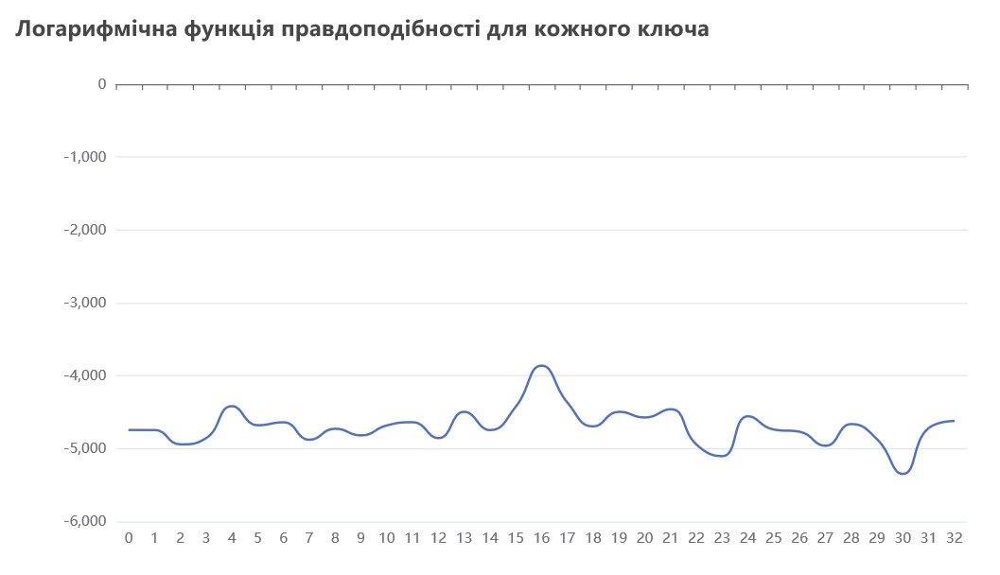
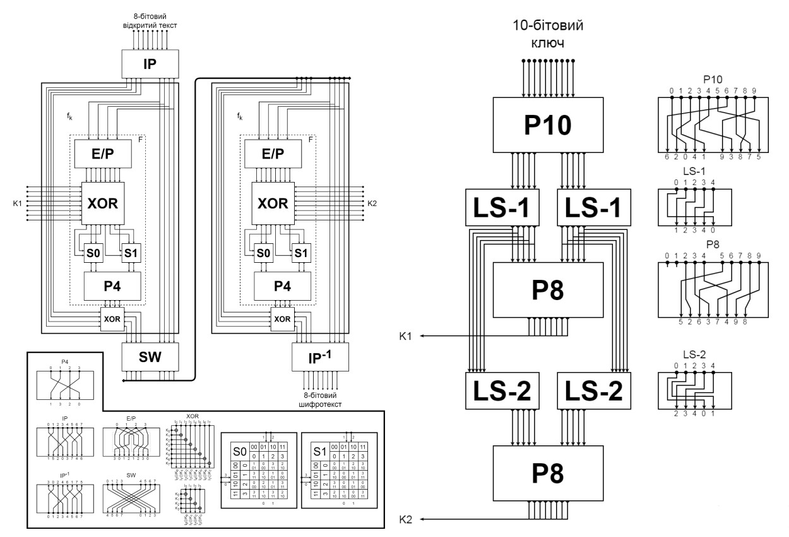
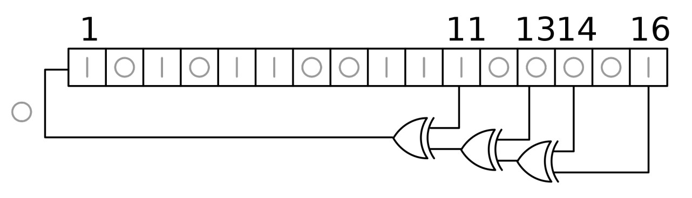

# Cryptography course projects

Here are some of the projects that I did as part of the cryptography course[^1] in university. Perhaps, someone may find those useful.

[^1]: _Криптографічні системи захисту інформації_, i.e. _Cryptographic information security systems_

## Caesar

First and foremost, the basic Caesar cipher task with a bit of a caveat:

> Write a program that implements Caesar cipher. Next, given an encrypted Ukrainian text, find a key using the estimate of the logarithmic likelihood function and decrypt it. Plot the log-likelihood function.

I used [go-echarts](https://github.com/go-echarts/go-echarts) to plot the function, it looks something like this:



To generate the HTML document from the screenshot, you can run

```bash
go run main.go caesar.go log.go chart.go
```

## Vigenère

It is another historic cipher that is essentially running several Caesar ciphers according to the key. The task was to crack it by determining the key length using the [Friedman test](https://en.wikipedia.org/wiki/Vigen%C3%A8re_cipher#Friedman_test) and then find the key content (I used the fact that space is the most frequent character in the Ukrainian text).

## Simplified DES

Next task was to implement a simplistic algorithm somewhat resembling DES. It was described as such:



To see it in action, you can run

```
go run main.go keygen.go sdes.go
```

## GOST 28147-89

An implementation of the famous Soviet algorithm and its modes of operation.

## LFSR

An implementation of a simplistic stream cipher based on LFSR.

Here is a picture of a 16-bit LFSR with a polynomial $x^{16} + x^{14} + x^{13} + x^{11} + 1$, similar to the one in the `lfsr/lfsr.go`:



```go
	var start, polynomial uint64 = 0xACE1, 0b1000000000101101
```

You can modify the code slightly ([lol](https://www.youtube.com/watch?v=QkcjCRE8Vvs)) or use a debugger to verify that `0xACE1` state is followed by `0x5670`, as it should, or convey other tests that you prefer.

To see file encryption and decryption, just run

```bash
go run lfsr.go
```

## SHA-1 CLI tool

There was such a task:

> Write a CLI tool that implements a hashing algorithm in your preferred programming language.

| Algorithm | Message source | Input |    Output     |
|:---------:|:--------------:|:-----:|:-------------:|
|   SHA-1   |      File      |  Hex  | Hash (in hex) |

You can build it or just run

```bash
go run main.go password.txt
```
